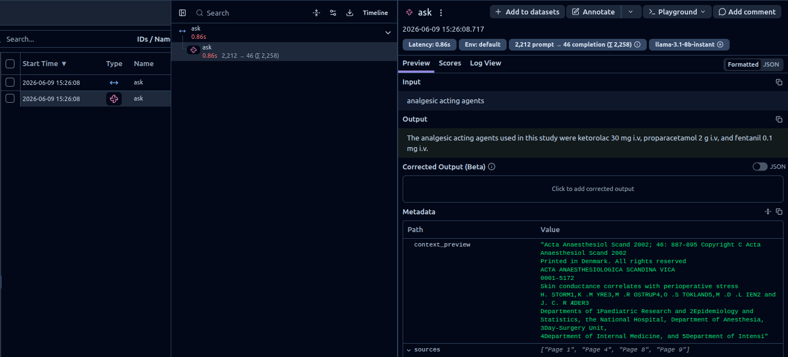

# DocMind 🧠

A RAG-based research paper assistant. Drop any PDF into the `docmind/data/` folder and ask questions about it in plain English.

Built as part of my AI engineering learning journey.

## Demo

Found: research-paper.pdf
Loading: research-paper.pdf
Loaded 9 pages → Split into 46 chunks → Vector store ready!
Your question: What were the main findings?
Answer: During tracheal intubation, the mean levels of skin conductance
fluctuations had the same stress response as norepinephrine levels.
The BIS did not show any stress response during tracheal intubation.
Sources: Page 1, Page 6, Page 7

## Observability

Every question is traced in Langfuse — token usage, latency, retrieved chunks, and cost per query.



## How it works

PDF
↓ load and chunk (1000 chars, 200 overlap)
46 chunks of text
↓ HuggingFace all-MiniLM-L6-v2
46 vectors (384 dimensions each)
↓ FAISS index
Stored and searchable
Your question
↓ same embedding model
Question vector
↓ FAISS MMR search (fetch 10, return 4 most relevant + diverse)

page 1 always included (abstract)
↓ Groq LLaMA 3.1 8b (temperature=0.1)
Grounded answer + source page numbers
↓ Langfuse
Every question traced — tokens, latency, retrieved chunks, cost

## Stack

- **LangChain** — PDF loading and text chunking
- **HuggingFace sentence-transformers** — text embeddings (free, runs locally)
- **FAISS** — vector store and semantic search
- **Groq** — fast LLM inference (free tier)
- **LLaMA 3.1 8b** — the language model
- **Langfuse** — observability, token tracking, and trace monitoring

## Setup

```bash
git clone https://github.com/mohidsanori/ai-engineering
cd ai-engineering
python -m venv venv
source venv/bin/activate
pip install -r requirements.txt
cp .env.example .env
# add your GROQ_API_KEY, LANGFUSE_PUBLIC_KEY, LANGFUSE_SECRET_KEY to .env
```

## Usage

1. Drop any PDF into `docmind/data/`
2. Run:

```bash
python docmind/main.py
```

3. If multiple PDFs are present, select one from the menu
4. Ask questions about your document

## Project structure

ai-engineering/
├── experiments/
│ └── text_analyzer.py ← first LLM call, Groq + structured JSON output
├── docmind/
│ ├── data/ ← drop PDFs here (gitignored)
│ └── main.py ← RAG pipeline with Langfuse observability
├── .env.example
├── .gitignore
└── README.md

## What I learned building this

- How RAG works end to end — chunking, embeddings, vector search, grounded generation
- Why chunk overlap matters (preserving meaning at boundaries)
- How MMR search produces more diverse and useful results than basic similarity search
- How temperature controls hallucination in LLM outputs
- Why always injecting the abstract fixes broad questions like "what is this about"
- How observability works in production AI systems — tracing every retrieval and LLM call with Langfuse

## What's next

- [x] Langfuse observability — token tracking, latency, trace monitoring
- [ ] Save and reload FAISS index (skip rebuilding on same PDF)
- [ ] Add conversation memory for follow-up questions
- [ ] Support multiple PDFs in one session
